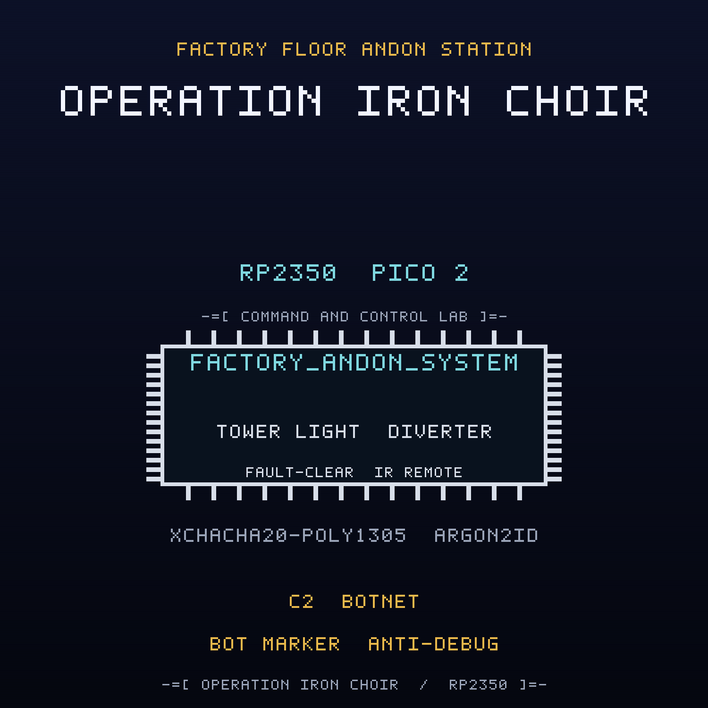

<br>

## FREE Reverse Engineering Self-Study Course [HERE](https://github.com/mytechnotalent/reverse-engineering)
## FREE Embedded Hacking Course [HERE](https://github.com/mytechnotalent/Embedded-Hacking)

<br>

# OPERATION IRON CHOIR CTF

### Act VII - The compromised factory floor andon station

<br>

***
**LEGAL DISCLAIMER:**
The information, tools, and code provided in this repository and course are strictly for educational, research, and defensive purposes only. 

You are explicitly prohibited from using any materials contained herein to access, test, modify, or exploit any device, network, or system that you do not own 100% or for which you do not have explicit, documented, and legally binding authorization to interact with.

By using this repository and course, you acknowledge and agree that:

1. Any illegal, unauthorized, or malicious use of this information is solely your responsibility.
2. The author(s) and contributor(s) of this repository and course shall not be held liable for any damages, legal repercussions, criminal charges, or unauthorized actions resulting from the use, misuse, or abuse of the contents herein.
3. You will comply with all applicable local, state, national, and international laws regarding cybersecurity and computer fraud.

**IF YOU DO NOT AGREE WITH THESE TERMS, DO NOT USE THIS REPOSITORY AND COURSE.**
***

<br>
<br>

> Hello again, friend.
>
> Act I was the lie. Act II was the door. Act III was the payload. Act IV was the
> payload that would not die. Act V was the payload that spreads. Act VI was the
> payload that steals. This is the payload that takes orders.
>
> WHITEOUT cut the siphon and cleared the staging marker, and for a shift the
> floor looked clean. Clean is not command. The Ministry did not need a locker
> that steals; it already had a fleet that listens. Somewhere between the loading
> dock and the line, the same hand that wrote the siphon wrote a leash.
>
> The andon station is the device every line trusts. A fault light tells the floor
> that a station needs a person. A diverter moves a bad part out of the stream. A
> control gateway authorizes a fault and an operator clears it. That is the whole
> contract, and it is a good one.
>
> FROSTLINE's implant in this one does not spread, and it does not steal. It
> registers. It checks in with a command-and-control listener on a fixed cadence,
> accepts a small set of remotely issued tasks, and writes a bot marker into the
> reserved sector so it comes back after a reflash. One station becomes one bot. A
> floor of stations becomes a fleet that can be driven in concert by whoever holds
> the listener.
>
> The tower light still says LINE OK. The diverter still sits where the last
> authorized command put it. Underneath, the station is taking orders from someone
> who is not the factory.
>
> Do not chase the tasks one at a time. Find the check-in. Stop the task handler.
> Clear the marker. Then seal the fault-clear path so nothing upstream can ever
> issue a task again.
>
> The green lamp is lit. The line is running. That is exactly the problem.

This is the companion capture-the-flag to the
[factory-andon-station](https://github.com/mytechnotalent/factory-andon-station)
project. Where the project builds the defended node, this CTF hands you the
**compromised** image that FROSTLINE shipped and asks you to find every defect,
prove it on real hardware, and patch the image.

<br>

## THE MISSION

The `ACT-VII.bin` image is the OPERATION IRON CHOIR factory floor andon station
with **four deliberate defects**. Each defect is an in-place, same-size byte
patch, so no address moves when you fix it. Every fix is provable on a Pico 2
with a Debug Probe.

| # | Name | What FROSTLINE did |
| - | ---- | ------------------ |
| 1 | The C2 Check-In | inverted the check-in gate so the node registers with the local command-and-control listener using the `C2V1` magic and bot id `0xB7` |
| 2 | The Task Handler | inverted the task gate so a `C2V1` frame runs the remotely issued benign tasks `TASK_BLINK`, `TASK_LOG`, and `TASK_REPORT` |
| 3 | The Bot Marker | inverted the marker gate so the first boot writes marker `0xC7` to reserved sector `0x103FF000` |
| 4 | The Fault-Clear Authorization | inverted the authorization verdict so an unauthenticated or replayed fault or clear envelope is accepted |

The wire is sealed with XChaCha20-Poly1305, keyed through Argon2id. The
cryptography is correct. Three of the four defects are not in the cipher at all:
they are an implant that listens to the raw control payload before the envelope
is ever opened, registers with a listener that holds no key, executes a small set
of remotely issued tasks, and writes a durable bot marker to the reserved sector.
The fourth is a policy seam in the fault command path. Read the dead, find the
check-in, and cut the leash.

<br>

## THE ARTIFACTS

| File | Role | SHA-256 |
| ---- | ---- | ------- |
| `ACT-VII.bin` | compromised firmware, the target | `c9996a62a7157e7aed43b3caf4e33348a87b8adfa4bbf67e1f1ff94df89cef42` |
| `ACT-VII.uf2` | flashable image of the target | `79b92868b5218572dfe41555e5b5157a01f1f277724ac5d7524de657f2def8e7` |
| `ACT-VII_fixed.bin` | corrected firmware, the solution | `b5fe79ce517f820449ad1dc2ecf628e6702891174abc9c33e923556d7f8c7534` |
| `ACT-VII_fixed.uf2` | flashable image of the solution | `6aa0f6742ae2baf8ab44f68a6d5bb7d26fa19901f3add2bc2a0311ddabd442f4` |

The two `.bin` files differ in exactly four bytes at offsets
`0x7541, 0xA2A9, 0xA3EF, 0xA47F`, and both are 51,196 bytes. The UF2 images are
102,912 bytes.

<br>

## THE DOCUMENTS

| Document | For |
| -------- | --- |
| [`ACT-VII-I.md`](ACT-VII-I.md) | Student instructions: the scenario, the tasks, the wiring |
| [`ACT-VII-R.md`](ACT-VII-R.md) | Requirements and grading criteria |
| [`ACT-VII-S.md`](ACT-VII-S.md) | Instructor solution key with exact offsets and bytes |
| [`ACT-VII-main-disasm.txt`](ACT-VII-main-disasm.txt) | Annotated disassembly of the four sabotage sites |
| [`DESIGN.md`](DESIGN.md) | Build blueprint (instructor eyes only) |

<br>

## HARDWARE

Everything runs on the Embedded Hacking breadboard, and the pin map is identical
to Acts I to VI so one board serves the whole foundation: a Pico 2, a Debug
Probe, a DHT11 line temperature sensor on GP4, a 1602 I2C LCD andon readout on
GP2/GP3 at address `0x27`, three tower light lamps (red GP16 FAULT, yellow GP17
ACK PENDING, green GP18 LINE OK), a fault-clear button on GP15, an SG90 line
diverter servo on GP14 with a 1000uF cap, a VS1838B infrared local fault-clear
remote on GP5, and an RYLR998 LoRa control link on UART1 GP8/GP9. The Debug Probe
is effectively required: the anti-debug trap is part of the exercise. The pin map
is in the instructions.

The cryptographic model is carried over from the earlier acts: Argon2id (`t=3`,
`p=1`, `m=64`) derives the field key, XChaCha20-Poly1305 seals every fault
command, and the anti-replay sequence window and authenticated-state tag are
reused unchanged. The implant is compiled only under `SANDBOX_ONLY`, which the
CTF build defines.

<br>

## QUICK START

Verify the two images against the expected patches and hashes:

```bash
python3 scripts/verify_ctf.py
```

Expected:

```text
10/10 checks passed
```

Build the corrected firmware from source:

```bash
rm -rf build && cmake -S . -B build -G Ninja -DPICO_BOARD=pico2 -DPICO_PLATFORM=rp2350-arm-s -DSANDBOX_ONLY=ON && cmake --build build
```

Run the firmware code standard audit:

```bash
python3 scripts/audit_c_standard.py
```

<br>

## REPOSITORY LAYOUT

```text
ACT-VII-I.md              student instructions
ACT-VII-R.md              requirements and grading criteria
ACT-VII-S.md              instructor solution key
ACT-VII.bin / .uf2        compromised artifact
ACT-VII_fixed.bin / .uf2  corrected artifact
ACT-VII-main-disasm.txt   annotated sabotage sites
scripts/verify_ctf.py     machine verifier
scripts/spoof.py          forged and replayed command injection
src/  include/            firmware sources
CMakeLists.txt            Pico SDK build
DESIGN.md                 build blueprint
```

<br>

## WHERE THIS FITS: OPERATION COLD IRON

This is the companion CTF for **Act VII (IRON CHOIR)** of the ten-act OPERATION
COLD IRON saga. The malware track began in Act III; in Act IV it became
persistence, in Act V it became propagation, in Act VI it became exfiltration,
and here it becomes command and control. Act VII is the act that teaches why a
green lamp is not a clean node, why a benign task set is still an obedience
channel, and why a fleet that listens is a fleet that can be driven. The project
it attacks is
[factory-andon-station](https://github.com/mytechnotalent/factory-andon-station).

- Previous act: Act VI, IRON COURIER, the smart logistics drop-box,
  [smart-logistics-dropbox](https://github.com/mytechnotalent/smart-logistics-dropbox)
- This act: Act VII, IRON CHOIR, the factory floor andon station
- Next act: Act VIII, IRON VAULT, datacenter-vent-controller (forthcoming)

<br>

## THE MINISTRY

The Ministry runs the state: the surveillance, the cold chain, the gates, the
pipelines, the air, the cabinets that hold what the state does not discuss, the
lockers that move it, and the factories that make it. NorthPharma is one of its
deniable industrial fronts, and FROSTLINE is the contractor that does the work no
Ministry letterhead will admit to. FROSTLINE did not break into this node; it
built the listener, taught the implant to register and wait, staged the bot
marker in a reserved sector, and signed the image. Against them is WHITEOUT, and
the engineer who copied the first image, NIGHTINGALE. This act is one station on
the Ministry's factory floor. TELESCREEN, the surveillance backbone that watches
it, comes after the ten.

- Project repository: [github.com/mytechnotalent/factory-andon-station](https://github.com/mytechnotalent/factory-andon-station)
- This CTF repository: [github.com/mytechnotalent/CTF_factory-andon-station](https://github.com/mytechnotalent/CTF_factory-andon-station)

<br>

# Next
[OPERATION IRON VAULT](https://github.com/mytechnotalent/datacenter-vent-controller)

<br>

# License
[MIT License](https://github.com/mytechnotalent/CTF_factory-andon-station/blob/main/LICENSE)
